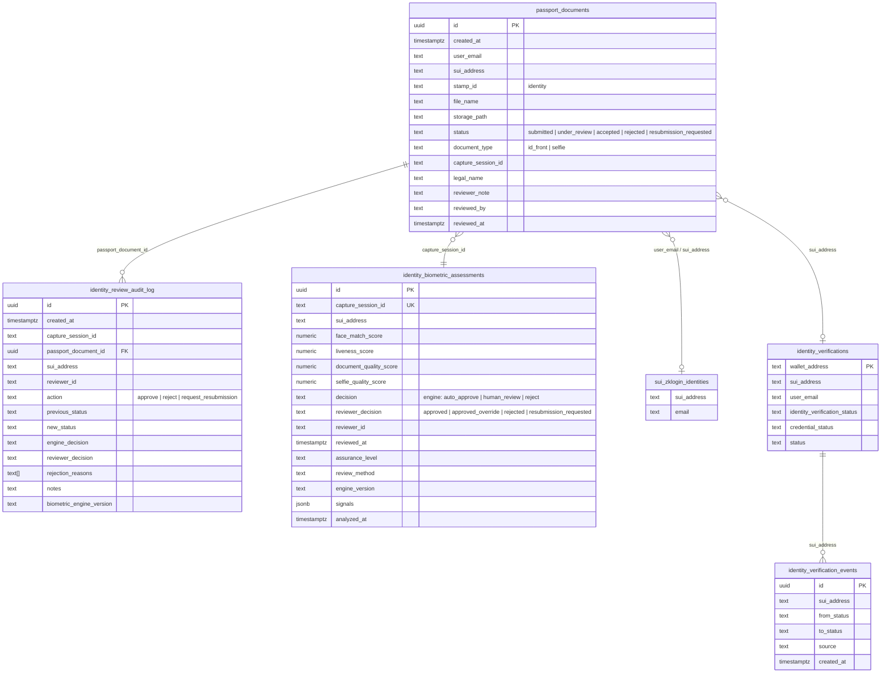

# Admin Identity Review Workflow

End-to-end manual identity review for Abraxas Verify (`/admin/identity`). Engine biometric decisions are stored separately from human reviewer decisions.

## Schema diagram



**Note:** There is no `capture_sessions` table. `capture_session_id` is a UUID shared by two `passport_documents` rows (ID + selfie) and one `identity_biometric_assessments` row.

## API routes

| Method | Route | Purpose |
|--------|-------|---------|
| `GET` | `/api/admin/identity/queue` | Load pending review queue |
| `POST` | `/api/admin/identity/approve` | Approve, reject, or request resubmission |
| `GET` | `/api/admin/identity/document-url` | Signed storage URL for ID/selfie preview |
| `POST` | `/api/identity/documents/capture` | User capture submit (engine runs here) |

All admin routes require header `x-admin-pin: <ADMIN_PIN>`.

### GET `/api/admin/identity/queue`

**Query:** `status=pending` (default), `all`, or a specific status.

**Pending query (exact logic):**

```typescript
sb.from("passport_documents")
  .select("id, created_at, user_email, sui_address, file_name, storage_path, status, reviewer_note, document_type, capture_session_id, legal_name")
  .eq("stamp_id", "identity")
  .in("status", ["submitted", "under_review"])
  .order("created_at", { ascending: false })
  .limit(200);
```

Biometric join (second query, by session):

```typescript
sb.from("identity_biometric_assessments")
  .select("capture_session_id, face_match_score, liveness_score, document_quality_score, selfie_quality_score, decision, assurance_level, review_method, engine_version, reviewer_decision, reviewer_id, reviewed_at, signals")
  .in("capture_session_id", sessionIds);
```

### POST `/api/admin/identity/approve`

**Body:**

```json
{
  "document_id": "<uuid>",
  "action": "approve | reject | request_resubmission",
  "reviewer": "admin",
  "note": "optional reviewer notes",
  "rejection_reasons": ["optional", "explicit reasons"],
  "jurisdiction": "US",
  "document_type": "passport"
}
```

**Approve — database updates:**

1. `passport_documents` → `status: accepted`, `reviewed_by`, `reviewed_at`, `reviewer_note`
2. `identity_biometric_assessments` → `reviewer_decision: approved` or `approved_override` (if engine was `reject`), `reviewer_id`, `reviewed_at` — **engine `decision` column unchanged**
3. `identity_verifications` → credential issued via `issueManualIdentityCredential`
4. `identity_review_audit_log` → immutable insert

**Reject — database updates:**

1. `passport_documents` → `status: rejected`
2. `identity_biometric_assessments` → `reviewer_decision: rejected`
3. `identity_verifications` → `identity_verification_status: declined`
4. `identity_verification_events` → transition event
5. `identity_review_audit_log` → immutable insert with `rejection_reasons`

**Request resubmission — database updates:**

1. `passport_documents` → `status: resubmission_requested`
2. `identity_biometric_assessments` → `reviewer_decision: resubmission_requested`
3. `identity_verifications` → `identity_verification_status: requires_resubmission`
4. `identity_review_audit_log` → immutable insert

User may submit a new capture after resubmission (not blocked by pending check).

## Engine vs reviewer decision

| Engine `decision` | Reviewer action | `reviewer_decision` stored |
|-------------------|-----------------|----------------------------|
| `human_review` | approve | `approved` |
| `auto_approve` | approve | `approved` |
| `reject` | approve | `approved_override` |
| any | reject | `rejected` |
| any | request_resubmission | `resubmission_requested` |

## Row Level Security

Admin API routes use `SUPABASE_SERVICE_ROLE_KEY`, which bypasses RLS. Tables involved:

| Table | RLS | Admin access |
|-------|-----|--------------|
| `passport_documents` | enabled | service role (no user-facing admin policies) |
| `identity_biometric_assessments` | enabled | `grant insert, select to service_role` |
| `identity_review_audit_log` | enabled | `grant insert, select to service_role`; update/delete revoked |
| Storage `passport-documents` | private bucket | signed URLs via service role |

Pilot auth is PIN-based (`lib/adminAuth.ts`), not Supabase Auth roles.

## Admin UI (`/admin/identity`)

Displays per submission:

- Applicant legal name, Google email, wallet address
- ID + selfie previews (signed URLs)
- Full biometric signal panel (fraud risk, face match, liveness, document type, quality, tamper, face detection, engine version)
- Engine decision vs reviewer decision
- Engine rejection reasons
- Reviewer notes textarea
- Actions: **Approve**, **Resubmit**, **Reject**

## Production validation checklist

After deploy, test on `https://abraxasworld.xyz` per `docs/VERIFY_MATRIX.md`. For each case verify in `/admin/identity` or Supabase:

- `signals.face_detected_selfie: false` for wall photos
- `signals.document_type: unknown` for random portraits
- High `fraud_risk` for junk images
- Engine `decision: reject` blocks queue entry (422 on capture)
- Reviewer actions write rows to `identity_review_audit_log`

## Schema audit (zero mismatch gate)

**Column provenance:** `reviewer_note`, `reviewed_by`, `reviewed_at` on `passport_documents` are from **migration 021**, not 050. Migration 050 adds `identity_review_audit_log` and `reviewer_decision` / `reviewer_id` / `reviewed_at` on **identity_biometric_assessments** only.

```bash
npm run identity:verify-schema    # probe live Supabase columns
npm run identity:seed-review-queue  # 5 pending + 2 approved + 2 rejected + 1 resubmit
```

Apply migrations **050** and **051** (051 grants UPDATE on biometric assessments for reviewer_decision).

### Corrected verification queries (after approve)

```sql
-- passport_documents (reviewed_by from 021)
select status, reviewed_by, reviewed_at, reviewer_note
from passport_documents where capture_session_id = '<session_id>';

-- biometric (reviewer_id / reviewer_decision from 050)
select decision, reviewer_decision, reviewer_id, reviewed_at, engine_version, signals
from identity_biometric_assessments where capture_session_id = '<session_id>';

-- audit log (reviewer_id from 050)
select action, engine_decision, reviewer_decision, reviewer_id, notes, created_at
from identity_review_audit_log where capture_session_id = '<session_id>';
```

