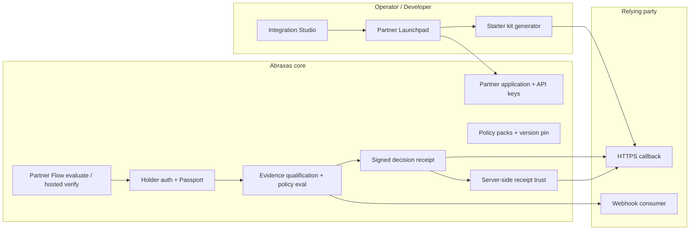

# Build #497 — Partner infrastructure audit (2026-10-10)

This document maps **what exists**, **what is wired to live paths**, and **prioritized gaps** for universal relying-party integration. It is evidence-based from repository inspection and automated tests — not a claim that every path was exercised against production infrastructure.

## Architecture map (concise)

| Subsystem | Implemented | Live path | Sandbox-only | Production-ready | Notes |
|-----------|-------------|-----------|--------------|------------------|-------|
| Integration Studio + Launchpad UI | Yes | Yes | — | Partial | Self-service sandbox; production gated |
| Application lifecycle + tenant scope | Yes | Yes | — | Yes | `partner_id` scoping on Launchpad APIs |
| Policy packs + pin | Yes | Yes | Some packs | Partial | `policyPacks.ts`; custom policy sandbox-only |
| Sandbox provisioning + API keys | Yes | Yes | Keys | Partial | One-time reveal patterns in production cred flow |
| Starter kits (Next/Express/Wix/serverless) | Yes | Yes | — | Partial | `@abraxas/partner-kit` + examples |
| Hosted Partner Flow | Yes | Yes | — | Yes | `/partner/verify`, evaluate API |
| Holder Passport + identity | Yes | Yes | — | Partial | Real paths; external IdV deps |
| Evidence reuse / freshness | Yes | Yes | — | Partial | Policy-specific; not auto-approve unrelated policy |
| Signed receipts + trust eval | Yes | Yes | — | Yes | `@abraxas/partner-kit/trust` canonical |
| Receipt verify (RP server-side) | Yes | Yes | — | Yes | Conformance fixtures + harness |
| Production activation | Yes | Yes | — | Partial | Atomic activation module; admin review required |
| Webhooks + retries + DLQ | Yes | Partial | Test events | Partial | `lib/partner/webhooks`, event delivery |
| Integration health / harness | Yes | Yes | Harness | Yes | `integrationHealth.ts`, sandbox readiness stages |
| Observability / pilot metrics | Yes | Partial | — | Partial | Launchpad activity; value evidence exports |
| Cross-chain (Solana/Sui/Creditcoin) | Partial | Optional | Mostly | No | Not on core partner receipt path |
| Good Trouble adapter | Yes | Yes | Pilot | N/A | **Adapter/config only** — must not define generic protocol |

## Prioritized findings (risk register)

### Critical

| ID | Finding | Mitigation in this build |
|----|---------|---------------------------|
| C1 | Sandbox success could be misread as production-ready | `deriveUniversalIntegrationReadiness` — production phases require review + activation |
| C2 | Receipt trust must fail closed | Existing conformance fixtures; extended matrix test in `universalIntegration.test.ts` |

### High

| ID | Finding | Mitigation / follow-up |
|----|---------|------------------------|
| H1 | Merchant-specific copy in Launchpad journey tests (Good Trouble) | Preserved for regression; generic Example Merchant proof added |
| H2 | Full holder E2E requires deployed env + credentials | Documented manual steps in independent partner proof |
| H3 | Checkout authorization on Wix not in Abraxas repo | Documented operator gap (Good Trouble merchant scope) |

### Medium

| ID | Finding | Follow-up |
|----|---------|-----------|
| M1 | Launchpad health JSON lacked canonical readiness phase | Added `universal_readiness` on health API |
| M2 | Developer troubleshooting scattered | `docs/UNIVERSAL_PARTNER_INTEGRATION.md` |
| M3 | Webhook schema / extended events often `action_required` | Existing health checks; not blocking sandbox verify |

### Low

| ID | Finding | Follow-up |
|----|---------|-----------|
| L1 | Cross-chain anchoring optional | Keep off critical path |
| L2 | Duplicate journey vs health signals | Mapped via readiness `signals` object |

## Good Trouble compatibility

- Good Trouble remains a **configured relying party** (`lib/goodTrouble/*`, Launchpad pins, Wix examples).
- **Generic protocol behavior** is defined by Partner Flow compatibility manifest, partner-kit trust, and Launchpad policy packs — not Good Trouble-specific URLs in core evaluate logic.
- No intentional breaking changes to Good Trouble adapters in this slice.

## Validation run (this branch)

| Command | Result |
|---------|--------|
| `vitest run lib/partner/universalIntegration lib/partner/partnerConformanceHarness.test.ts lib/partner/launchpad/integrationHealth.test.ts lib/policy/changeControl/changeControlHealthRoute.test.ts` | **23/23 passed** |
| `NEXT_PUBLIC_SUPABASE_URL=… NEXT_PUBLIC_SUPABASE_ANON_KEY=… SUPABASE_SERVICE_ROLE_KEY=… npm run build` | **passed** (after `npm install` on clean main checkout) |

## Next milestone (recommended Build #498)

1. Launchpad UI surface for `universal_readiness.phase` on application dashboard.
2. Live sandbox E2E script using real `PARTNER_FLOW_RP_*` against staging (no mocks for receipt issuance).
3. Tenant isolation audit tests on evaluate + receipt verify API routes (cross-partner IDs).
4. Webhook delivery failure injection tests tied to operator alerts.
5. Metering / billing event integrity review (commercial Phase 14).
