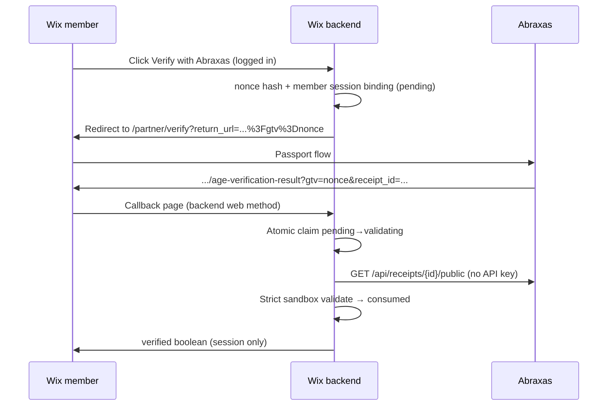

# Good Trouble Canna — Wix Abraxas Sandbox

Planning reference for optional Abraxas Passport age verification on Wix. **Do not treat as live until operator configuration is confirmed.**

## Experience

| Path | Behavior |
|------|----------|
| **Primary** | “Yes, I’m 21 or older” — existing Wix self-attestation only |
| **Secondary** | “Verify with Abraxas Passport” — redirect to Abraxas Partner Flow |

## Abraxas constants

```
partner_id=good-trouble-cannabis
policy_id=good-trouble-retail-v1
entry=https://abraxasworld.xyz/partner/verify
callback=https://www.goodtroublecanna.com/age-verification-result
```

Allowlist stores the callback **without** query string. Runtime `return_url` may include `?gtv={nonce}`; Abraxas preserves it on redirect.

## Age enforcement (code)

Policy evaluation requires `product_eligibility` with outcome `over_21`, derived server-side from authoritative IDV document DOB. No DOB, age, or document images are exposed to Wix, callbacks, or public receipts.

Migration: `supabase/migrations/075_good_trouble_retail_age_eligibility_claim.sql` — **not applied** by this batch.

## Receipt validation (Wix backend)

Use strict **sandbox** mode:

- `signature_valid === true`
- `decision_result === "approved"`
- `status === "active"`
- `partner_id` / `policy_id` exact match
- `schema_version === "1.0.0"`
- `artifact_type === "eligibility_decision_receipt"`
- valid future `expires_at`
- all `evaluated_claim_refs[].status === "active"`
- `production_usable === false` exactly
- `decision_context === "sandbox_only"`
- `invalidation_reasons === ["production_not_usable:false"]` only

Reference: `examples/good-trouble-wix/backend/abraxasReceiptValidator.js`

## Nonce / replay protection

Session binding uses **Wix Members backend only** (`member:{currentMember.id}`). Anonymous Wix visitors cannot use the Abraxas path — Wix Velo does not expose a non-spoofable server-side visitor identity without trusting frontend input.



### Nonce state transitions

| State | Meaning |
|-------|---------|
| `pending` | Issued, awaiting callback |
| `validating` | Short-lived claim during receipt fetch/validate |
| `consumed` | Terminal — success or permanent failure |

Concurrent callbacks: at most one `validating` claim succeeds. Transient receipt-fetch failures release to `pending` for bounded retry; invalid receipts consume without granting verification.

### Collection permissions

`AbraxasVerificationNonces` — backend web methods only. No site-visitor or member direct read/create/update/delete. Store hash + session binding + lifecycle metadata only.

## Operator checklist (read-only — run before go-live)

Confirm via admin APIs or onboarding console **without exposing secrets**:

| Check | How |
|-------|-----|
| Partner `good-trouble-cannabis` exists | `GET /api/admin/partners/onboarding?partner_id=good-trouble-cannabis` |
| Policy `good-trouble-retail-v1` assigned and active | Same response: `assigned_policy_id`, `active_policy.status` |
| Sandbox allowed | `allowed_environments` includes `sandbox` |
| Wix callback allowlisted | `allowed_return_urls` contains `https://www.goodtroublecanna.com/age-verification-result` (no query) |
| No duplicate `goodtroublecanna` partner | List/search partners — expect absent or unused |
| Sandbox API key (boolean only) | `GET /api/admin/partner-keys?partner_id=good-trouble-cannabis` — count active `abx_test_` prefixes; **not required** for public-receipt path |
| Preflight | `GET /api/admin/partner-flow/provisioning-preflight?partner_id=...&policy_id=...&return_url=...` |

**Not required for this integration:** `abx_test_…` key for redirect or public receipt GET.

**Optional later:** `abx_live_…` key, production env promotion, production receipt validator mode.

## First-time Abraxas steps (honest)

1. Google sign-in (zkLogin — Abraxas derives wallet address)
2. Wallet binding (signed control proof — required by policy)
3. Identity verification (ID + selfie when policy requires)
4. Partner consent ceremony
5. Return to Wix with signed receipt

Returning users with an active credential may complete in seconds.

## API key necessity

| Operation | Key required? |
|-----------|----------------|
| Partner Flow redirect | No |
| Public receipt GET | No |
| Credential JWT verify (`POST /api/credentials/verify`) | Yes — `abx_test_…` / `abx_live_…` |
| Webhooks | Yes — `webhooks:read` scope |

## Related code

- `lib/idv/ageEligibility.ts` — DOB parsing and eligibility (internal only)
- `lib/policy/evaluatePolicy.ts` — `minimum_age` → `product_eligibility` requirement
- `lib/partner/verifyPartnerFlowReceipt.ts` — strict sandbox/production modes
- `examples/good-trouble-wix/` — Wix Velo reference
