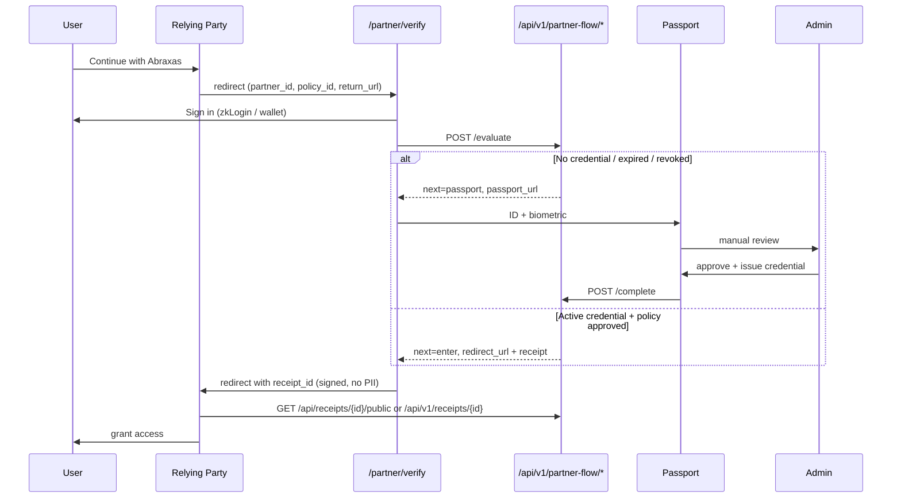

# Partner Flow Integration (Reference: Good Trouble)

Generic relying-party verification flow. Good Trouble (`good-trouble-cannabis`) is the reference configuration — future partners adopt the same flow via config, not new code.

## Flow summary

### First visit
1. User lands on partner site → clicks **Continue with Abraxas**
2. Redirect to `/partner/verify?partner_id=…&policy_id=…&return_url=…`
3. User authenticates (Google zkLogin or wallet)
4. `POST /api/v1/partner-flow/evaluate` — no valid credential → Passport
5. ID + biometric capture → manual review → credential issued
6. `POST /api/v1/partner-flow/complete` → signed session receipt
7. Redirect to `return_url` with `receipt_id` (no PII)

### Returning user
1. Same entry → authenticate
2. `evaluate` detects active credential → policy check → session receipt in **one call**
3. Redirect to partner — **no Passport, no selfie, no manual review**

### Expired / revoked credential
- `evaluate` routes back to Passport → re-verification → new credential → partner redirect

## Sequence diagram



## API routes

| Route | Method | Purpose |
|-------|--------|---------|
| `/api/v1/partner-flow/evaluate` | POST | Credential detection + policy eval + routing |
| `/api/v1/partner-flow/complete` | POST | Post-approval redirect + session receipt |
| `/api/v1/partner-flow/refresh` | POST | Re-issue expired session receipt |
| `/api/receipts/{id}/public` | GET | Public receipt validation (no PII) |
| `/api/v1/receipts/{id}` | GET | Partner-authenticated receipt validation |
| `/api/credentials/verify` | POST | Server-side credential JWT verification |

## UI routes

| Route | Purpose |
|-------|---------|
| `/partner/verify` | Generic partner verification hub |
| `/good-trouble/enter` | Good Trouble reference callback |
| `/passport` | Identity verification (only when required) |

## Partner configuration

Per-partner (database):
- `partners.allowed_return_urls` — redirect URI allowlist
- `partner_policies.rules_json.session_receipt_hours` — session receipt TTL (default 24h)
- `partner_policies.rules_json.minimum_age` — age gate (partners receive `over_21`, never DOB)

Code config (`lib/goodTrouble/partnerIntegration.ts`):
```typescript
export const GOOD_TROUBLE_INTEGRATION: PartnerIntegrationConfig = {
  partnerId: "good-trouble-cannabis",
  policyId: "good-trouble-retail-v1",
  enterPath: "/good-trouble/enter",
  displayName: "Good Trouble",
};
```

## PII boundary

Partners receive only:
- `decision`, `credential_id`, `receipt_id`, `receipt_expires_at`
- `identity_verified`, `over_21`, `assurance_level`, `reason_codes`
- Signed receipt (validatable via public endpoint)

Partners never receive: ID images, biometrics, document numbers, DOB, address, legal name.

## Tests

```bash
npx vitest run lib/partner/relyingPartyFlow.test.ts
npm test
```

Coverage: new user routing, returning user bypass, expired/revoked → passport, denied, under-21, session receipt TTL, PII sanitization, URL builders.

## Adding a new partner

1. Insert `partners` row with `allowed_return_urls`
2. Insert `partner_policies` with rules + `session_receipt_hours`
3. Create `enterPath` callback page using `PartnerEnterClient`
4. Add `PartnerIntegrationConfig` (copy Good Trouble pattern)
5. Link **Continue with Abraxas** → `buildPartnerVerifyUrl(config)`

No changes to `relyingPartyFlow.ts` required.
