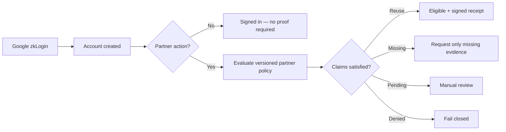

# Progressive Proof Foundation

Abraxas separates **account sign-in**, **held credentials**, and **partner eligibility**. Partners consume a documented verification result; Sui zkLogin powers Abraxas sign-in without requiring partners to adopt Abraxas's internal chain.

## Journey

### States

| UI state | Meaning |
|----------|---------|
| `signed_in` | Account exists; partner action may not require proof yet |
| `proof_needed` | Policy requires evidence the holder has not supplied |
| `pending` | Review in progress |
| `eligible` | Policy satisfied — receipt may be issued |
| `denied` | Policy or claim revocation blocks access |
| `expired` | Required claim expired |
| `error` | System or validation failure |

**Rule:** missing proof never maps to `eligible`.

## Model (`lib/progressiveProof/`)

- **Claim record** — type, issuer, assurance level, issue/expiry/status, consent scope, wallet binding
- **Sign-in providers** — Google zkLogin is default; providers never satisfy regulated claims
- **Policy evaluation** — `evaluateProgressiveProof` + `evaluateProgressiveProofFromPolicy`
- **Partner surface** — `buildPartnerVerificationSurface` — minimal, audience-bound, no raw documents
- **Handoff readiness** — `isProgressivePartnerHandoffReady` — browse policies do not require full IDV credential

## Adding a new industry

1. Add a versioned row to `partner_policies` with `required_claims` (and optional `browse_access_only`, `consent_required`, etc.).
2. Register the policy in `lib/policy/productionPolicyContract.ts` for client-side resolution and audit.
3. Map evidence collection to `ProofEvidenceStep` in `evidenceRouting.ts` if a new claim type needs a new step.
4. Do **not** fork identity UI — reuse `/partner/verify` → `/partner/continue` and Passport evidence steps.

Google sign-in must not count as proof of age, residency, legal identity, or wallet ownership (including Solana).

## Identity path audit (fixed conflations)

| Location | Old behavior | Fix |
|----------|--------------|-----|
| `partnerFlowHandoff.ts` | Required `identityStatus === "earned"` for all policies | Policy-aware `isProgressivePartnerHandoffReady` |
| `passportCustomerStatus.ts` | "Eligibility not yet verified" on account page | "No partner proof on file yet" |
| `signInCopy.ts` | Implied verification at sign-in | Explicit account-only helper |
| `partnerProofAgent.ts` | Skipped policy eval without L2 credential | Browse policies evaluate claims without full IDV |
| `evaluate.ts` | Unsigned users mapped to `signed_in` | `proof_needed` + `sign_in` step |

## Compatibility & rollout

1. **Ship module + tests** (this PR) — no schema changes.
2. **DEMO** — run Good Trouble browse + retail regression tests; validate partner-flow evaluate on preview.
3. **Partner integrations** — partners already consuming receipts unchanged; new `ui_state` available on progressive surfaces.
4. **Stocklana pilot** — lands on separate branch (`cursor/stocklana-solana-eligibility-d541`); reuses this policy model.
5. **Production** — enable after DEMO sign-off; no MAIN Supabase or production Vercel changes in this PR.

## Regression tests

- `lib/progressiveProof/*.test.ts`
- `lib/passport/partnerFlowHandoff.progressive.test.ts`
- Existing: `lib/goodTrouble/goodTroubleRetailWiring.integration.test.ts`, `lib/assurance/selfAttestation/tieredAgeAssurance.test.ts`
