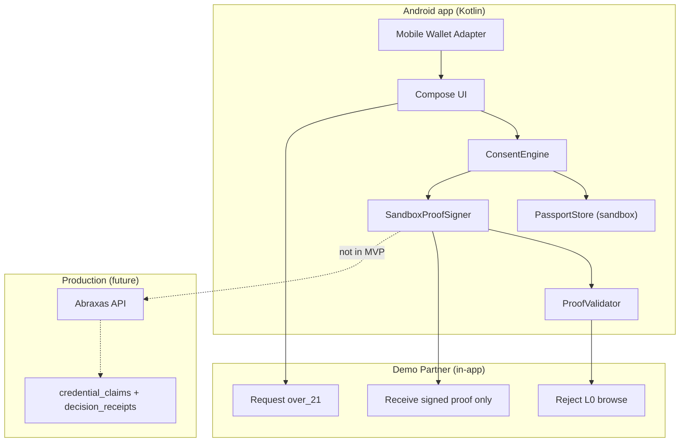
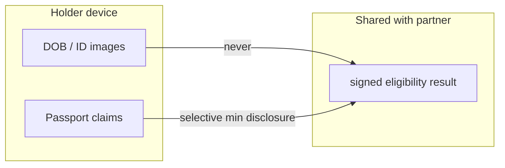

# Clock In Solana Mobile Hackathon — Abraxas Passport MVP Plan

**Hackathon:** Solana Mobile CLOCK IN (Sep 8 – Oct 8, 2026)  
**Product thesis:** Applications should receive proofs, not profiles.  
**Branch:** `cursor/solana-mobile-passport-mvp-d541`  
**Status:** Implementation in progress — draft PR, no Production deploy

---

## 1. Repository audit summary

### 1.1 What exists today

| Area | Status | Key paths |
|------|--------|-----------|
| **Primary identity** | Sui zkLogin + browser session | `lib/sui/zklogin/`, `/api/auth/zklogin/*` |
| **Wallet binding** | Sui + EVM implemented; Solana type only | `lib/walletBinding/suiChallenge.ts`, `lib/walletAuthority/` (`WalletChain` includes `"solana"` — no bind API) |
| **Passport / claims** | Production web | `lib/credentials/claimsService.ts`, `lib/credentials/claimSchema.ts` |
| **Consent ceremony** | Web component + API | `components/passport/ConsentCeremony.tsx`, `/api/v1/verification-requests/{id}/consent` |
| **L0 browse** | Self-attest + signed JWT | `lib/assurance/selfAttestation/`, `good-trouble-browse-v1` |
| **L2+ purchase** | Decision receipts | `lib/decisionReceipts/`, `good-trouble-retail-v1` |
| **Partner flow** | Evaluate / complete / refresh | `lib/partner/relyingPartyFlow.ts`, `/api/v1/partner-flow/*` |
| **Good Trouble Wix** | Reference integrator | `examples/good-trouble-wix/` (148 tests) |
| **Solana web** | Legacy vault/mint UI | `@solana/wallet-adapter-*`, `lib/solana/` — **not** Passport-bound |
| **Solana on-chain** | Undeployed Anchor skeleton | `abraxas-program/` |
| **Native Android** | **None** | No `.gradle`, `.kt`, React Native, or Expo |

### 1.2 Security tests to preserve (must not weaken)

| Suite | Path | Covers |
|-------|------|--------|
| Tiered age assurance | `lib/assurance/selfAttestation/tieredAgeAssurance.test.ts` | L0/L2 boundary, DOB never stored |
| Origin guard | `lib/assurance/selfAttestation/originGuard.test.ts` | CSRF on self-attest |
| Wix lifecycle | `examples/good-trouble-wix/backend/tieredLifecycleSecurity.test.js` | Purpose confusion, replay, downgrade |
| Partner receipts | `lib/partner/verifyPartnerFlowReceipt.test.ts` | Signed receipt validation |
| Decision receipts | `lib/decisionReceipts/decisionReceipts.test.ts` | Canonical signing, no PII |

### 1.3 Gaps for Solana Mobile MVP

| Gap | Impact | MVP approach |
|-----|--------|--------------|
| No Android project | Blocker for hackathon | New `apps/abraxas-passport-android/` (Kotlin + Compose + MWA) |
| No MWA integration | Blocker | `mobile-wallet-adapter-clientlib-ktx` + demo fallback wallet |
| Identity is Sui-centric | Mobile can't reuse zkLogin session trivially | **Sandbox mode** keyed by Solana wallet pubkey; document production path |
| No Solana wallet binding API | Can't bind Passport to Solana on server | Demo binds locally; production needs new `/api/wallet/binding` Solana challenge (post-hackathon) |
| Self-attest requires browser Origin | Native HTTP blocked | Mobile uses consent proof flow in sandbox; production needs mobile auth channel |
| No Android SDK in CI | Can't build APK in cloud agent | Source-complete Gradle project; judges build locally |
| Physical device + wallet app | Required for MWA demo | Seed Vault / Phantom Mobile on Seeker or Android |

---

## 2. Reusable production APIs (post-sandbox)

These remain **unchanged** and are the production integration target:

| API | Mobile use (future) |
|-----|---------------------|
| `POST /api/v1/partner-flow/evaluate` | Partner deep-link entry |
| `GET /api/v1/verification-requests/{id}` | Consent preview |
| `POST /api/v1/verification-requests/{id}/consent` | Holder approval |
| `POST /api/v1/partner-flow/complete` | Regulated completion |
| `GET /api/credentials/claims` | Passport claims |
| `POST /api/age-assurance/browse-receipt/verify` | Partner validates L0 JWT |
| `GET /api/receipts/{id}/public` | Partner validates L2+ receipt |

**Not weakened:** URL params, sessionStorage flags, L0 receipts, and unverified wallet state never authorize regulated actions (enforced in `lib/solanaMobile/mobileProofValidator.ts` and Kotlin `ProofValidator.kt`).

---

## 3. Recommended stack

| Layer | Choice | Rationale |
|-------|--------|-----------|
| Mobile | **Kotlin + Jetpack Compose** | Solana Mobile official path; not a WebView wrapper |
| Wallet | **Mobile Wallet Adapter 2.0** (`clientlib-ktx`) | Hackathon requirement; Sign-In With Solana optional |
| Demo logic | **In-app sandbox** + shared validators | Works offline; no Production secrets |
| CI tests | **Vitest** (`lib/solanaMobile/`) | Runs without Android SDK |
| On-device tests | **JUnit** (`ProofValidatorTest.kt`) | Mirrors vitest vectors |

---

## 4. MVP scope (vertical slice)

### In scope

1. Connect Solana wallet via MWA (or demo wallet in sandbox mode)
2. Display reusable Passport claims (seeded in sandbox)
3. Demo partner requests `over_21` for `good-trouble-retail-v1` / `purpose=purchase`
4. Consent screen: exact share / never-share lists
5. Issue signed eligibility proof (sandbox Ed25519 — structure matches production receipts)
6. Privacy-safe receipt + consent history
7. **Reject** L0 browse proof for L2+ purchase request (live demo of downgrade block)

### Out of scope (documented, not built)

- Production Abraxas server session / zkLogin on mobile
- Solana on-chain program deployment
- Full IDV (Veriff) on device
- Wix / Good Trouble production callback
- Auto Wix member federation
- App Store / dApp Store publish

---

## 5. Architecture

### Privacy boundary

---

## 6. Mock vs production-capable

| Component | MVP | Production path |
|-----------|-----|-----------------|
| Wallet connect | MWA + demo fallback | MWA + SIWS + server bind |
| Passport claims | `DemoSeed` local JSON | `GET /api/credentials/claims` |
| Consent UI | In-app Compose (mirrors `ConsentCeremony`) | Same UX calling live API |
| Proof signing | Sandbox Ed25519 key in app assets | `ABRAXAS_SIGNING_KEY` server-side |
| Partner validation | In-app `ProofValidator` | `verifyPartnerFlowReceipt` / browse-receipt verify |
| Purchase gate | Kotlin + vitest fail-closed | `purchaseEligibilityAuthorization.js` |

---

## 7. Timeline (before October 8)

| Week | Deliverable |
|------|-------------|
| **Sep 9–12** | Plan, Android scaffold, MWA connect, sandbox seed, validators + vitest |
| **Sep 13–20** | Consent flow, proof issuance, history, L0 rejection demo, README |
| **Sep 21–28** | Physical device testing (Seeker/Android), polish, demo video script |
| **Sep 29–Oct 7** | APK hardening, submission checklist, pitch deck |
| **Oct 8** | Submit APK + repo + video |

**Realistic for hackathon:** Full vertical slice + installable APK + 3-minute demo. Production server coupling is a follow-on.

---

## 8. Secrets, infrastructure, device requirements

### Required for production mobile (not in MVP)

| Secret / infra | Purpose |
|----------------|---------|
| `ABRAXAS_SIGNING_KEY` / `ABRAXAS_PUBLIC_KEY` | Receipt signing |
| Supabase + session cookies | Holder auth |
| Google OAuth (zkLogin) | Identity |
| Solana RPC (devnet recommended first) | On-chain optional |
| Partner `allowed_return_urls` | Callback allowlist |

### Required for hackathon demo

| Item | Notes |
|------|-------|
| Android device or emulator (API 26+) | Physical Seeker preferred |
| MWA wallet app | Seed Vault, Phantom, or Solflare Mobile |
| JDK 17+ | Build APK |
| Android SDK 34 | `ANDROID_HOME` |
| No production secrets | `DEMO_MODE=true` uses sandbox signer |

### `.env.example` (no secrets)

See `apps/abraxas-passport-android/.env.example`.

---

## 9. Implementation phases (this PR)

### Phase A — Shared validation (CI)

- `lib/solanaMobile/mobileProofValidator.ts`
- `lib/solanaMobile/mobileProofBoundary.test.ts`
- Fixtures aligned with `browseReceiptValidator.js` and `purchaseEligibilityAuthorization.js`

### Phase B — Android app

- `apps/abraxas-passport-android/` Gradle project
- MWA wallet connector + demo fallback
- Screens: Connect → Passport → Partner Request → Consent → Result → History
- `ProofValidator.kt` + JUnit tests

### Phase C — Hackathon docs

- `apps/abraxas-passport-android/README.md`
- `DEMO_SCRIPT.md` (3-minute)
- `SUBMISSION_CHECKLIST.md`
- Architecture diagrams (this file)

---

## 10. Submission checklist (preview)

- [ ] Functional Android APK (`./gradlew :app:assembleDebug`)
- [ ] MWA wallet connect on physical device
- [ ] GitHub repo with source
- [ ] Demo video (3 min)
- [ ] Pitch deck / brief
- [ ] Clear mock vs production disclosure
- [ ] Security tests green in CI
- [ ] No Production deploy or credential rotation

---

## 11. Non-goals (explicit)

- Do **not** weaken existing web/Wix authorization
- Do **not** merge to `main` without review
- Do **not** deploy Production or modify production data
- Do **not** ship WebView wrapper of abraxasworld.xyz as the hackathon app
