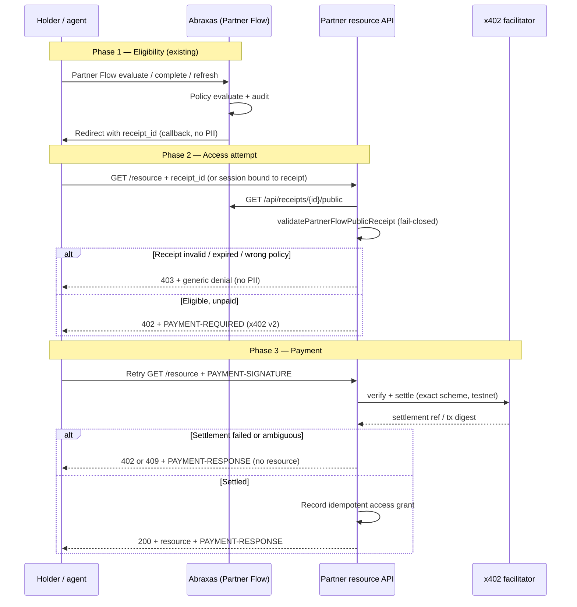

# x402 + Abraxas Access Architecture and Security Design

**Status:** Design only — no payment processing, wallet custody, settlement, database migrations, or production routes in this phase.

**Audience:** Engineering, security review, partner operators, compliance.

---

## 1. Purpose

Define the **safest minimal** integration that lets a relying party combine:

1. **Abraxas eligibility proof** — a signed, time-bounded decision receipt from Partner Flow / policy evaluation, and  
2. **x402 payment proof** — a facilitator-verified settlement authorization for a priced resource,

**before** granting paid API access or a paid digital good.

This document is grounded in the **current Abraxas codebase** (Partner Flow, decision receipts, partner API keys, audit contracts) and **x402 protocol version 2** (not legacy `X-PAYMENT` headers).

---

## 2. Current state (codebase inventory)

### 2.1 What exists today

| Capability | Location | Role in combined gate |
|------------|----------|------------------------|
| Partner Flow (browser) | `lib/partner/relyingPartyFlow.ts`, `POST /api/v1/partner-flow/{evaluate,complete,refresh}` | Issues eligibility; browser session auth |
| Signed decision receipts | `lib/decisionReceipts/*`, `GET /api/receipts/{id}/public` | Partner-verifiable eligibility artifact |
| Receipt trust evaluation | `lib/decisionReceipts/trustEvaluation.ts`, `lib/partner/verifyPartnerFlowReceipt.ts` | Fail-closed signature, expiry, policy/partner match |
| Policy engine | `lib/policy/evaluatePolicy.ts` | Rules for claims, sandbox, `session_receipt_hours` TTL |
| Partner audit contract | `lib/partner/partnerFlowAuditContract.ts` | PII-scrubbed `audit_events` metadata |
| Partner API keys | `lib/partner/partnerAuth.ts`, scopes `verify:requests` etc. | Server-to-server Abraxas APIs (not Partner Flow browser) |
| Partner onboarding | `components/admin/PartnerOnboardingConsole.tsx` | Pilot partner, callback allowlist, policy publish |
| Cielo on-chain USDC verify | `lib/cielo/paymentVerify.ts` | **Vertical rental payments** — not wired to Partner Flow |
| x402 stubs (non-production) | `app/api/payment/x402/route.ts`, `app/api/reports/[assetId]/route.ts` | **v1-style `X-Payment`**, no facilitator verification |

### 2.2 Explicit gaps (pre-integration)

- Decision receipt canonical payload has **no** `payment_settlement_ref`, `x402_correlation_id`, or settlement fields (`lib/decisionReceipts/canonical.ts`).
- Policy rules have **no** `settlement_required` or price configuration.
- Partner Flow audit has **no** `payment.*` actions; no binding between receipt issuance and settlement.
- Existing x402 routes use **deprecated v1 headers** (`X-Payment`, `X-Payment-Version`) and **must not** be extended for production.
- No facilitator client, no idempotent settlement store, no replay prevention for payment payloads.

### 2.3 x402 protocol alignment (official v2)

Per [x402 specification v2](https://github.com/x402-foundation/x402/blob/main/specs/x402-specification-v2.md) and [HTTP transport v2](https://github.com/x402-foundation/x402/blob/main/specs/transports-v2/http.md):

| Item | Value |
|------|--------|
| **Protocol version** | `x402Version: 2` (required) |
| **HTTP status** | `402 Payment Required` for payment needed / retry |
| **Server → client (requirements)** | `PAYMENT-REQUIRED` header — Base64 JSON `PaymentRequired` |
| **Client → server (authorization)** | `PAYMENT-SIGNATURE` header — Base64 JSON `PaymentPayload` |
| **Server → client (settlement result)** | `PAYMENT-RESPONSE` header — Base64 JSON `SettlementResponse` |
| **Network identifiers** | CAIP-2 (v2); not legacy free-form strings |
| **Facilitator** | HTTP APIs for verify + settle (resource server may self-host or delegate) |

**Do not mix v1 `X-PAYMENT` / `X-PAYMENT-*` headers with v2.** Existing Abraxas stubs are v1 and are **out of scope** for this design’s production path.

**Schemes (v2):** `exact` and `upto` typically settle in the HTTP round trip; `batch-settlement` authorizes now and settles on-chain later per network binding. MVP should use **`exact`** on testnet only.

---

## 3. Two products

### Product A — Abraxas-paid APIs

**Who pays:** Partner (or partner’s agent) pays **Abraxas** per verification / policy / receipt operation.

**Who gates:** Abraxas resource server returns `402` on metered endpoints (e.g. `POST /api/v1/policies/evaluate`, future metered receipt issuance).

**Eligibility + payment:** Payment proves commercial entitlement to consume Abraxas API quota; eligibility proof may still be required for holder-scoped operations.

| Pros | Cons |
|------|------|
| Direct Abraxas revenue | Abraxas becomes merchant of record for API access |
| Central metering | Requires treasury, pricing, refunds, facilitator ops on Abraxas |
| Single integrator contract | Higher compliance surface (billing, tax, sanctions on payers) |

### Product B — Partner-paid gated access (recommended MVP)

**Who pays:** End user or agent pays **the partner** for a partner-owned resource.

**Who gates:** Partner API / content server returns `402` after eligibility is established.

**Eligibility + payment:** Abraxas supplies **only** the signed decision receipt; partner combines receipt validation + x402 settlement before fulfillment.

| Pros | Cons |
|------|------|
| Reuses Partner Flow + public receipt validation as-is | Partner must implement x402 + facilitator |
| Abraxas does not custody funds or set partner prices | Correlation IDs must be agreed between parties |
| Smallest change to Abraxas trust boundary | Partner operational quality varies |
| Clear separation: identity/policy vs commerce | Two-party support model |

---

## 4. Recommended MVP: Product B (testnet-first)

### 4.1 Why Product B first

1. **Eligibility path is production-grade today** — signed receipts, `validatePartnerFlowPublicReceipt`, audit trace, rate limits.
2. **Payment stays on partner infrastructure** — no Abraxas wallet custody, treasury, or settlement SLA in v1.
3. **Minimizes “pay to pass verification” risk** — Abraxas never sells approval; partner sells access **after** independent eligibility proof.
4. **Aligns with x402’s resource-server model** — `402` is returned by the **paid resource**, not by the identity issuer.
5. **Testnet scope is narrow** — Base Sepolia or Solana devnet USDC via a reference facilitator (e.g. Coinbase CDP x402); sandbox policies (`production_usable: false`) for pilot partners.

Product A remains phase-2 once facilitator patterns, idempotency store, and billing compliance are proven on partner-paid pilots.

### 4.2 MVP scope boundaries

**In scope (design → testnet pilot):**

- Documented request sequence and correlation IDs  
- Partner reference implementation (separate repo / example)  
- Abraxas **read-only** eligibility APIs (existing public receipt + optional status)  
- New **audit event types** (design only until pilot code)  
- Facilitator verify/settle integration on **partner side**

**Out of scope until production gate:**

- Abraxas-hosted `402` on production APIs  
- Database migrations for settlement persistence at Abraxas  
- Production mainnet settlement  
- MoonPay / fiat rails  
- Embedding payment fields inside decision receipt canonical payload (requires schema version bump + security review)

---

## 5. Request sequence (Product B MVP)



### 5.1 Ordering invariants (security)

| # | Invariant |
|---|-----------|
| 1 | **Eligibility before payment requirement** — Partner must not emit `PAYMENT-REQUIRED` until receipt validation passes. |
| 2 | **Payment before fulfillment** — Resource body must not leak until facilitator reports success (or idempotent replay of prior success). |
| 3 | **No pay-to-pass at Abraxas** — Partner Flow routes never accept `PAYMENT-SIGNATURE`; payment cannot influence policy evaluation. |
| 4 | **Receipt independence** — Decision receipt issuance is unchanged by payment state. |
| 5 | **Separate TTLs** — Receipt expiry (`expires_at`) and x402 `maxTimeoutSeconds` are both enforced. |

---

## 6. Configuration model

### 6.1 Partner configuration (partner-operated)

| Field | Description |
|-------|-------------|
| `partner_id` | Abraxas pilot partner id |
| `policy_id` | Active policy for eligibility |
| `allowed_return_urls` | Existing callback allowlist |
| `resource_url` | Protected API path returning `402` |
| `price_amount` | Atomic units (e.g. USDC 6 decimals) |
| `price_asset` | CAIP-19 asset id (testnet USDC) |
| `network` | CAIP-2 network (testnet only for MVP) |
| `pay_to` | Partner treasury address (partner custody) |
| `facilitator_url` | Verify/settle base URL |
| `access_grant_ttl_sec` | How long settled access is valid (≤ receipt remaining TTL) |

Stored in partner’s config — **not** in Abraxas DB for MVP.

### 6.2 Abraxas policy configuration (existing)

| Field | MVP use |
|-------|---------|
| `sandbox_only: true` | Required for testnet pilot |
| `session_receipt_hours` | Receipt TTL (default 24h) |
| `required_claims` | Eligibility rules unchanged |
| `production_usable` | Must be `false` in pilot |

**No new policy fields in MVP code.** Optional future: `access_binding_mode: single_use | reusable_within_ttl`.

### 6.3 Abraxas operator configuration (pilot)

| Decision | MVP value |
|----------|-----------|
| Public receipt endpoint | Enabled (existing) |
| Rate limits | Enabled (`partnerFlowRateLimit`) |
| New Abraxas `402` routes | **Disabled** |
| Facilitator credentials at Abraxas | **None** (partner-held) |

---

## 7. Idempotency and payment replay prevention

### 7.1 Partner-side durable store (required before pilot code)

Partner maintains a settlement ledger (KV/DB), keyed by:

```
idempotency_key = SHA256(partner_id || resource_id || receipt_id || payment_payload_hash)
```

| Column | Purpose |
|--------|---------|
| `idempotency_key` | Primary idempotency |
| `receipt_id` | Eligibility binding |
| `payment_payload_hash` | Detect replay of same authorization |
| `settlement_ref` | Facilitator / on-chain reference |
| `status` | `pending` \| `settled` \| `failed` \| `ambiguous` |
| `access_grant_expires_at` | Replay window for resource delivery |
| `created_at` | Audit ordering |

### 7.2 Behaviors

| Scenario | Behavior |
|----------|----------|
| Same `PAYMENT-SIGNATURE` retry within TTL | Return **same** `200` + `PAYMENT-RESPONSE`; **no** second settlement |
| Same receipt, **new** payment after prior success | Policy: default **deny** (single-use access per receipt) unless partner config allows reuse |
| Settlement succeeds, response lost | Client retries with same signature → idempotent `200` |
| Receipt expires mid-payment | Abort; `402` with new requirements after re-eligibility |
| Duplicate receipt_id, different payments | Only first settled grant wins per `single_use` mode |

Abraxas does **not** store payment payloads in MVP. Optional future: Abraxas-operated correlation service for Product A.

---

## 8. Settlement failure and ambiguous states

| State | HTTP | Partner action | Holder experience |
|-------|------|----------------|-------------------|
| Facilitator verify fails | `402` | Log `payment.verify_failed`; do not fulfill | Retry with valid wallet |
| Facilitator settle fails | `402` + `PAYMENT-RESPONSE` error | Mark `failed`; do not fulfill | Retry payment |
| Verify OK, settle timeout | `409` or `402` | Mark `ambiguous`; **manual reconcile** job | “Payment processing — retry with same signature” |
| Settle OK, DB write fails | `503` | Compensating: do not double-settle on retry | Safe retry (idempotent) |
| Receipt valid at verify, expired at fulfill | `403` | Deny; require new Partner Flow | Re-authenticate |

**Ambiguous rule:** Never fulfill on ambiguous settlement. Prefer **at-most-once** resource delivery over **at-least-once** payment.

---

## 9. Audit event model (no PII)

Extend **partner** audit (partner systems) and optionally **Abraxas** `audit_events` with correlation-only metadata.

### 9.1 Abraxas events (proposed — pilot phase)

| Action | When | Metadata (allowed keys only) |
|--------|------|------------------------------|
| `partner_flow.receipt_issued` | Existing | `receipt_id`, `flow_trace_id`, `partner_id`, `policy_id` |
| `access.eligibility_verified` | Partner polls public receipt (optional Abraxas proxy later) | `receipt_id`, `partner_id`, `policy_id`, `outcome` |
| `access.payment_correlation` | Optional webhook from partner (pilot) | `receipt_id`, `partner_id`, `payment_correlation_id`, `settlement_status` |

**Forbidden in all payment-related audit metadata:** email, wallet address, raw IP, JWT, payment payload, facilitator API keys, `pay_to` amounts tied to identity.

### 9.2 Partner events (required for pilot)

| Event | Metadata |
|-------|----------|
| `eligibility.checked` | `receipt_id`, `partner_id`, `policy_id`, `valid` |
| `payment.required` | `receipt_id`, `resource_id`, `x402_version`, `network` |
| `payment.verify_requested` | `payment_correlation_id`, `idempotency_key` |
| `payment.settled` | `payment_correlation_id`, `settlement_ref`, `status` |
| `access.granted` | `payment_correlation_id`, `receipt_id`, `grant_expires_at` |
| `access.denied` | `reason_code` (enum), no PII |

Align reason codes with `lib/decisionReceipts/trustEvaluation.ts` invalidation prefixes where applicable.

---

## 10. Receipt validation and expiry requirements

Before emitting `402`, partner **must** call Abraxas public receipt view and run equivalent checks to `validatePartnerFlowPublicReceipt`:

| Check | Source |
|-------|--------|
| Ed25519 `signature_valid` | Public receipt view |
| `decision_result === "approved"` | Trust evaluation |
| `status === "active"` | Trust evaluation |
| `expires_at` not passed | Trust evaluation |
| `partner_id` / `policy_id` match | Expectations |
| `production_usable` | `false` allowed in testnet pilot via `allowSandbox: true` |

**Additional MVP rules:**

- Re-validate receipt immediately before fulfillment (TOCTOU window).  
- `access_grant_ttl_sec` ≤ remaining receipt TTL.  
- Do not accept callback query parameters as proof (`PARTNER_FLOW_CALLBACK_PII_NOTE` — verify server-side only).  
- Rate-limit public receipt fetches (existing Abraxas limits apply).

---

## 11. Responsibility matrix

| Concern | Partner | Abraxas | External facilitator |
|---------|---------|---------|----------------------|
| Holder identity / policy | — | Partner Flow + policy engine | — |
| Eligibility receipt signing | — | Abraxas | — |
| Public receipt verification API | Consumer | Hosts `GET /api/receipts/{id}/public` | — |
| HTTP `402` + x402 v2 headers | **Owner** | Not in MVP | — |
| Treasury / `pay_to` | **Owner** | — | — |
| Payment verify + settle | Integrates | — | **Owner** |
| Idempotency / replay store | **Owner** | — | — |
| Paid resource body | **Owner** | — | — |
| Partner onboarding / policy publish | Consumer | Admin console | — |
| API keys for Abraxas S2S | Consumer | Issues scoped keys | — |
| Sanctions / KYC on payer | **Owner** (commerce) | Eligibility only | May assist |

---

## 12. No custody and no “pay to pass verification”

| Principle | Implementation |
|-----------|----------------|
| **No Abraxas custody** | MVP: all settlement to partner `pay_to`; Abraxas holds no private keys for partner commerce |
| **No pay-to-pass** | `POST /api/v1/partner-flow/*` ignores payment headers; policy evaluation has no price gate |
| **Eligibility is not for sale** | Decision receipts cannot be issued in exchange for payment in MVP design |
| **Separate artifacts** | Eligibility = decision receipt; payment = x402 settlement ref — linked only by partner correlation id |

---

## 13. Compliance and security review boundaries

Required reviews **before production gate** (not required for this docs-only PR):

| Review | Scope |
|--------|-------|
| **Security architecture** | Facilitator trust, header validation, idempotency, replay, TOCTOU |
| **Legal / compliance** | Partner as merchant of record; money transmission boundaries; sanctions |
| **Privacy** | Audit metadata scan; no PII in payment logs |
| **Partner contract** | Liability for failed settlement, refunds, chargebacks |
| **Schema change** | If payment fields ever added to receipt canonical payload |

**MVP testnet pilot** requires: security sign-off on partner reference implementation + Abraxas receipt validation checklist only.

---

## 14. Implementation roadmap

### Phase 0 — Design (this document)

- [x] Architecture + threat model  
- [ ] Operator decision log (section 15)  
- [ ] Partner pilot agreement template  

### Phase 1 — Testnet pilot (code allowed after Phase 0 sign-off)

| Workstream | Deliverable |
|------------|-------------|
| Partner reference | Example resource server: eligibility → `402` v2 → settle → fulfill |
| Facilitator | Testnet `exact` scheme via chosen facilitator (CDP x402 or self-hosted) |
| Abraxas | Optional `access.payment_correlation` audit webhook receiver (read-only) |
| Abraxas | **Deprecate** v1 stubs (`X-Payment`) — do not extend |
| Conformance | Extend `partner-conformance` harness with receipt+payment sequence fixtures |
| Docs | Partner integration guide addendum |

**Exit criteria:** End-to-end testnet demo; no mainnet; no Abraxas custody; idempotency tests pass; ambiguous settlement never fulfills.

### Phase 2 — Production gate

| Gate | Requirement |
|------|-------------|
| Mainnet network + asset allowlist | Operator-approved |
| Abraxas receipt schema | Unchanged unless versioned migration approved |
| Product A scoping | Separate PRD + billing compliance |
| Facilitator SLA | Uptime, reconcile, support runbook |
| Rate limits + abuse | Partner + Abraxas coordinated |
| Retire sandbox | `production_usable: true` policies only |
| Security re-review | Full threat model delta |

### Phase 3 — Product A (optional)

- Metered Abraxas APIs with x402 v2  
- Abraxas treasury + facilitator  
- `verify:requests` scope extension or new `billing:settle` scope  
- `partner_api_usage` ↔ settlement correlation  

---

## 15. Infrastructure and operator decisions (before code)

| # | Decision | Options | Owner | Blocks |
|---|----------|---------|-------|--------|
| 1 | **MVP product** | Product B (recommended) vs A | Product + Eng | All implementation |
| 2 | **Testnet** | Base Sepolia USDC vs Solana devnet USDC | Eng | Facilitator config |
| 3 | **Facilitator** | Coinbase CDP x402 vs self-hosted vs other | Eng + Security | Partner reference |
| 4 | **x402 version** | v2 only (`PAYMENT-*` headers) | Eng | Header implementation |
| 5 | **Receipt reuse** | Single-use vs reusable within TTL | Product + Legal | Idempotency rules |
| 6 | **Pilot partners** | Which `partner_id` + sandbox policies | Ops | Onboarding console |
| 7 | **Correlation** | Partner-only ledger vs Abraxas webhook | Eng | Audit events |
| 8 | **Access grant TTL** | Default seconds (≤ receipt TTL) | Product | Partner config |
| 9 | **Ambiguous settlement** | 409 vs 402 retry policy | Eng | Client UX |
| 10 | **Deprecate v1 stubs** | Timeline to remove `app/api/payment/x402` v1 | Eng | Confusion risk |
| 11 | **MoonPay / fiat** | Explicitly out of scope for x402 MVP | Product | Scope creep |
| 12 | **Mainnet gate** | Compliance checklist owner | Legal | Production |

---

## 16. References

- x402 specification v2: https://github.com/x402-foundation/x402/blob/main/specs/x402-specification-v2.md  
- x402 HTTP transport v2: https://github.com/x402-foundation/x402/blob/main/specs/transports-v2/http.md  
- x402 HTTP 402 concepts: https://docs.x402.org/core-concepts/http-402  
- Abraxas Partner Flow: `docs/PARTNER_FLOW_INTEGRATION.md`  
- Abraxas public receipt trust: `lib/decisionReceipts/trustEvaluation.ts`  
- Abraxas rate limits: `docs/PARTNER_FLOW_RATE_LIMITS.md`  
- Existing roadmap stub: `lib/protocolArchitecture.ts` (`X402_ARCHITECTURE`)

---

## 17. Document history

| Version | Date | Notes |
|---------|------|-------|
| 0.1 | 2026-08-07 | Initial design — docs only, no implementation |
