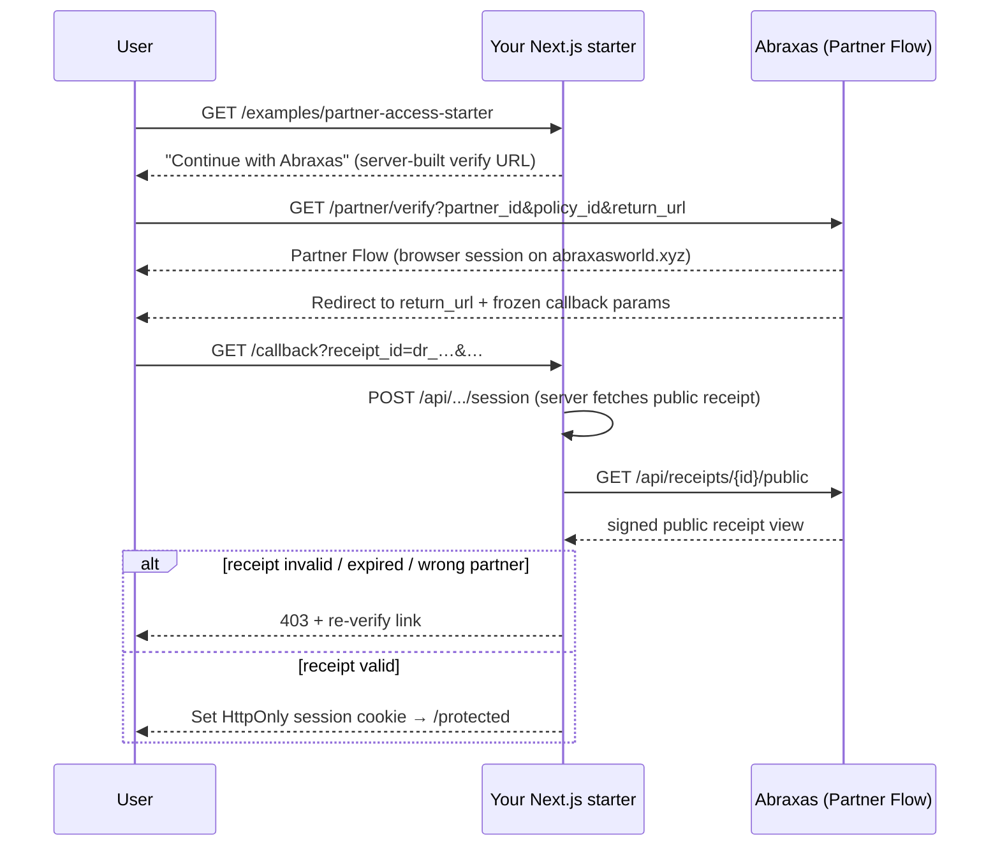

# Abraxas Partner Access — Next.js Starter

**REFERENCE STARTER — x402-agnostic.** A copyable relying-party integration that demonstrates the core Abraxas Partner Flow access pattern in one afternoon.

This is **not** production deployment. It is a minimal Next.js App Router example you can adapt for your protocol.

**Canonical Abraxas host:** `https://abraxasworld.xyz`

---

## Runtime isolation (default disabled)

The starter pages and session API ship inside the Abraxas app but are **disabled by default**. They do **not** activate from generic `PARTNER_FLOW_RP_*` production variables alone.

| Gate | Env var | Default |
|------|---------|---------|
| Server-only opt-in | `PARTNER_ACCESS_STARTER_ENABLED` | `false` (unset = off) |

When disabled:

- Entry, callback, protected page, session API, and logout API return **404** (or a generic disabled response)
- No missing environment-variable names are listed publicly
- No receipt fetch and no starter cookie read/write

When enabled, use **starter-specific** `PARTNER_ACCESS_STARTER_*` variables (see `.env.example`). The shared `PARTNER_FLOW_RP_*` names are for `npm run partner:conformance` and other conformance tooling — not for silently enabling this in-repo demo.

---

## What this demonstrates

| Step | Implementation |
|------|----------------|
| Entry | “Continue with Abraxas” → canonical `/partner/verify` URL |
| Callback | Frozen query params only → server-side receipt verification |
| Session | Signed **HttpOnly** cookie (sample — supply your own secret in production) |
| Protected page | Shown only after valid receipt verification |

No x402 payments, no Supabase migrations, no OAuth changes, no API keys in browser code.

---

## Flow



---

## Quick start (local)

### 1. Operator provisioning (Abraxas)

Before testing, Abraxas operators must:

1. Create your `partner_id` and `policy_id`
2. Add your **exact** callback URL to `partners.allowed_return_urls`

See `docs/PARTNER_ONBOARDING_CHECKLIST.md`. There is no self-serve production provisioning.

### 2. Configure environment

```bash
cp examples/partner-access-nextjs-starter/.env.example .env.local
# Set PARTNER_ACCESS_STARTER_ENABLED=true and fill PARTNER_ACCESS_STARTER_* vars
```

### 3. Run conformance (recommended)

```bash
npm run partner:conformance
```

Uses separate `PARTNER_FLOW_RP_*` variables (not the starter runtime gate).

### 4. Start the app

```bash
npm run dev
```

Open `http://localhost:3000/examples/partner-access-starter` (only when opted in).

### 5. Test the callback

Complete Partner Flow and land on `/examples/partner-access-starter/callback`. The starter verifies the receipt server-side and redirects to `/protected` on success.

---

## Reference starter vs production deployment

| | Reference starter | Production deployment |
|---|-------------------|----------------------|
| Runtime gate | `PARTNER_ACCESS_STARTER_ENABLED=true` | Your own feature flag / routing |
| Session secret | `PARTNER_ACCESS_STARTER_SESSION_SECRET` sample | Your KMS/HSM-backed secret rotation |
| Session store | Signed cookie only | Consider server-side session store + replay protection |
| Callback URL | Single env var | Exact allowlisted HTTPS URLs per environment |
| Receipt validation | `validatePartnerFlowPublicReceipt` | Same logic + monitoring, audit, rate limits |
| Hosting | In-repo demo route | Your infrastructure, your domain |

---

## Security contract

- **Frozen callback params only** — `status`, `decision_id`, `receipt_id`, `receipt_expires_at`, `credential_id`, `policy_id`, `partner_id`
- **No PII in URLs** — rejects `email`, `wallet`, `jwt`, `token`, documents, selfies
- **Fail closed** — signature, status, expiry, partner, policy mismatches → 403
- **Server-side verification** — `GET /api/receipts/{id}/public` from your API route only
- **No browser storage of secrets** — no localStorage/sessionStorage for receipts or JWTs
- **HttpOnly session cookie** — production partners must supply their own secure session secret
- **Exact return URLs** — `validatePartnerReturnUrlFormat` rejects query strings, stale hosts, root paths
- **Default disabled** — no accidental activation from Abraxas production `PARTNER_FLOW_RP_*` config

---

## Code layout

| Path | Role |
|------|------|
| `examples/partner-access-nextjs-starter/lib/` | Copyable logic (config, runtime gate, callback params, session, verify) |
| `app/examples/partner-access-starter/` | Next.js pages (entry, callback, protected) |
| `app/api/examples/partner-access-starter/session/` | Server verify + session cookie |
| `lib/partner/verifyPartnerFlowReceipt.ts` | Shared receipt validation (monorepo) |

---

## Good Trouble (optional labeled example only)

Good Trouble (`good-trouble-cannabis`) is Abraxas's hosted pilot checkout — see `lib/goodTrouble/pilotExample.ts`. **Do not use Good Trouble ids as defaults.** This starter uses generic `PARTNER_ACCESS_STARTER_*` env vars only.

---

## Tests

```bash
npx vitest run examples/partner-access-nextjs-starter
```

Covers runtime isolation (default disabled, generic RP vars cannot enable), callback allowlist, receipt grant/deny paths, route 404s, no stale `abraxas-app.vercel.app`, and no PII in protected responses.

---

## Further reading

- `docs/PARTNER_FLOW_REFERENCE_INTEGRATION.md`
- `examples/partner-flow-web-rp/README.md` — minimal non-Next.js RP
- `docs/PARTNER_ONBOARDING_CHECKLIST.md`
