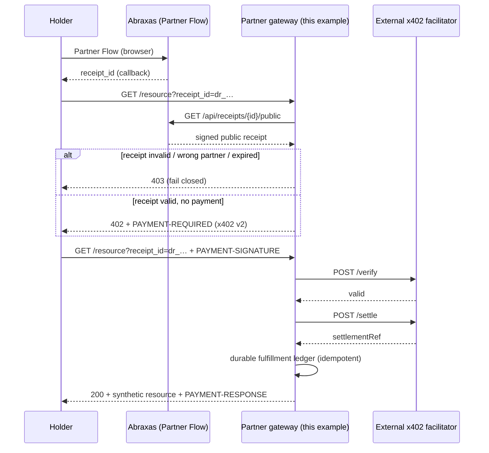

# x402 + Abraxas Partner Flow — testnet reference gateway

**TESTNET / DEMO ONLY.** This example shows how a **partner** (not Abraxas) combines:

1. **Abraxas eligibility** — signed Partner Flow decision receipt (`GET /api/receipts/{id}/public`)
2. **x402 v2 payment** — `PAYMENT-REQUIRED` → `PAYMENT-SIGNATURE` → facilitator verify/settle → `PAYMENT-RESPONSE`
3. **Protected resource** — synthetic JSON payload after both gates pass

**Not included:** Abraxas custody, mainnet payments, production paywalls, wallet creation, facilitator credentials in-repo, or database migrations.

**Network:** Base Sepolia only (`eip155:84532`).

---

## Architecture



---

## Partner configuration (operator-supplied)

Set these environment variables on **your** gateway host. Abraxas does not store payment config.

| Variable | Required | Description |
|----------|----------|-------------|
| `X402_REF_GATEWAY_ENABLED` | yes | Must be `true` to expose the demo route |
| `X402_REF_PARTNER_ID` | yes | Abraxas pilot `partner_id` |
| `X402_REF_POLICY_ID` | yes | Sandbox/testnet policy id |
| `X402_REF_ABRAXAS_BASE_URL` | yes | e.g. `https://abraxasworld.xyz` |
| `X402_REF_FACILITATOR_URL` | yes | External facilitator base URL (you operate) |
| `X402_REF_PAY_TO` | yes | Partner treasury on Base Sepolia (you custody) |
| `X402_REF_RESOURCE_URL` | yes | Canonical URL of this protected resource |
| `X402_REF_PRICE_AMOUNT` | no | Atomic USDC units (default `10000` = 0.01 USDC) |
| `X402_REF_PRICE_ASSET` | no | CAIP-19 testnet USDC on Base Sepolia |
| `X402_REF_FULFILLMENT_STORE_PATH` | no | File path for demo ledger (production: use SQL — see below) |

**Facilitator auth:** supply via your deployment platform (e.g. `Authorization` header). This repo does **not** ship facilitator secrets.

---

## Abraxas prerequisites (unchanged)

1. Operator-provisioned `partner_id`, `policy_id`, callback allowlist
2. Holder completes Partner Flow → `receipt_id` on callback
3. Sandbox policy (`production_usable: false`) for testnet pilots

See `examples/partner-flow-web-rp/README.md` and `docs/PARTNER_ONBOARDING_CHECKLIST.md`.

---

## Demo walkthrough (no live facilitator required for unit tests)

### 1. Obtain eligibility

Complete Partner Flow and capture `receipt_id` from the callback.

### 2. Request protected resource (no payment)

```bash
curl -si "https://YOUR_HOST/api/examples/x402-partner-flow-gateway/resource?receipt_id=dr_YOUR_RECEIPT"
```

Expect **402** with `PAYMENT-REQUIRED` (Base64 JSON, x402 v2).

### 3. Pay and retry (with facilitator configured)

Retry the same URL with a valid `PAYMENT-SIGNATURE` header. The gateway:

1. Re-validates the Abraxas receipt (fail closed on expiry / partner mismatch)
2. Verifies payment with your facilitator
3. Settles via facilitator (never fulfills on ambiguous settlement)
4. Records fulfillment in a **durable ledger** (idempotent replays return the same `200` + `PAYMENT-RESPONSE`)

### 4. Idempotent replay

Send the **same** `PAYMENT-SIGNATURE` again within the access grant TTL → **200** without a second settlement.

---

## Production fulfillment store (required operator choice)

The reference route uses a **file-backed ledger** for local demos. Production partners must use a durable database. Schema (not applied by Abraxas):

```sql
-- See lib/x402/referenceGateway/fulfillmentStore.ts — FULFILLMENT_LEDGER_SQL_SCHEMA
```

Idempotency key:

```
SHA256(partner_id || resource_id || receipt_id || payment_payload_hash)
```

**Do not** rely on in-memory deduplication for production fulfillment claims.

---

## Security boundaries

| Data | Logged / persisted by this example |
|------|-------------------------------------|
| `receipt_id`, `partner_id`, `policy_id`, settlement status | Allowed (correlation only) |
| Raw `PAYMENT-SIGNATURE`, JWTs, email, wallet addresses, identity claims | **Forbidden** |

Fail closed on: invalid receipt, wrong partner/policy, expired receipt, invalid payment, facilitator failure, settlement ambiguity, duplicate fulfillment conflicts.

---

## Code layout

| Path | Role |
|------|------|
| `lib/x402/referenceGateway/` | Testable gateway logic |
| `app/api/examples/x402-partner-flow-gateway/resource/route.ts` | Next.js demo route |
| `docs/X402_ABRAXAS_ARCHITECTURE.md` | Design context |
| `docs/X402_THREAT_MODEL.md` | Threat model |

Run tests:

```bash
npx vitest run lib/x402/referenceGateway lib/docs/x402ArchitectureDocs.test.ts
```

---

## Future operator choices (not in this PR)

1. **Facilitator vendor** — CDP x402, self-hosted, or other v2-compatible service
2. **Treasury `pay_to`** — partner-controlled Base Sepolia address
3. **Production ledger** — Postgres / DynamoDB using the documented schema
4. **Mainnet** — out of scope; requires separate security review and policy hardening
